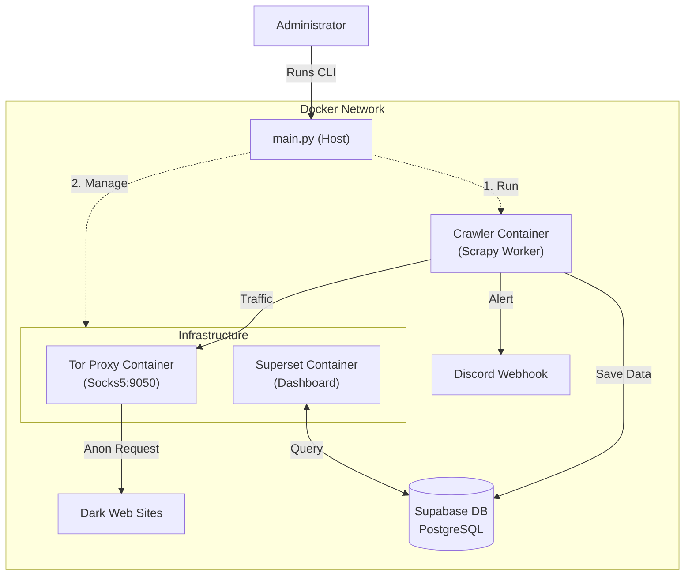

# TriCrawl


**Ransomware Leak Scraper & Monitor**

TriCrawl monitors ransomware leak sites and dark web forums. It scrapes new posts via Tor, filters them by keywords, and sends alerts to Discord.
It is a project designed to demonstrate an automated pipeline from collection to visualization.

랜섬웨어 유출 사이트 및 다크웹 포럼 크롤링, 모니터링 도구입니다. 
Tor 네트워크를 통해 게시물을 수집하고, 키워드로 필터링하여 디스코드로 알림을 전송합니다.
수집부터 시각화까지의 자동화 파이프라인을 구현한 자동화 도구입니다.

---

## Features (기능)

- **Tor Integration**: Routes all scraper traffic through a local Tor SOCKS5 proxy (Dockerized).
- **Dedup Logic**: Checks IDs before crawling detail pages to minimize Tor network requests.
- **Keyword Filtering**: Matches content against a keyword list to assign risk levels.
- **Discord Notification**: Sends alerts via Webhook for items matching specific criteria.
- **Data Storage**: Archives all structured data into PostgreSQL (Supabase).
- **Dashboard**: Simple visualization of leak trends using Apache Superset.

- **Tor 연동**: 모든 트래픽을 Docker 내부의 Tor SOCKS5 프록시로 라우팅합니다.
- **중복 제거**: 상세 페이지 요청 전, ID를 확인하여 불필요한 네트워크 부하를 줄입니다.
- **키워드 필터**: 사전 정의된 키워드와 매칭하여 위험도를 분류합니다.
- **디스코드 알림**: 조건에 맞는 데이터 수집 시 웹훅으로 알림을 보냅니다.
- **데이터 저장**: 수집된 정형 데이터를 PostgreSQL(Supabase)에 적재합니다.
- **대시보드**: Apache Superset을 이용해 수집 추이를 시각화합니다.

### Supported Sites (수집 대상)

TriCrawl currently supports 9 dark web sites, categorized into Ransomware Blogs and Underground Forums.
현재 9개의 다크웹 사이트(랜섬웨어 블로그 및 포럼)를 지원합니다.

| Spider Name | Type | Description |
|:---|:---|:---|
| **`abyss`** | Ransomware | Abyss Ransomware Blog |
| **`akira`** | Ransomware | Akira Ransomware Blog |
| **`lockbit`** | Ransomware | LockBit 3.0 Blog (Archive) |
| **`lockbit5`** | Ransomware | LockBit 5.0 Blog (New) |
| **`play_news`** | Ransomware | Play Ransomware Blog |
| **`rhysida`** | Ransomware | Rhysida Ransomware Blog |
| **`best_carding_world`** | Forum | Best Carding World (Carding) |
| **`bfdx`** | Forum | BFDX (Hacking Forum) |
| **`darknet_army`** | Forum | DarkNetArmy (XenForo) |

## Architecture (아키텍처)

The system consists of a CLI manager on the host and isolated Docker containers for the crawler, proxy, and dashboard.
시스템은 호스트의 CLI 매니저와, Docker 컨테이너(크롤러/프록시/대시보드)로 구성됩니다.



## Prerequisites (사전 준비)

- **Docker Desktop**: Must be installed and running.
  (반드시 설치되어 있고, 실행 중이어야 합니다.)

- **Python 3.10+**: For local execution of the CLI manager.
  (CLI 매니저 실행을 위해 로컬 Python 3.10 이상이 필요합니다.)

- **Supabase Project**: You need a hosted Supabase project.
  (클라우드 Supabase 프로젝트가 필요합니다.)

## Installation & Setup (설치 및 설정)

### 1. Database Setup (Supabase)

Run the following SQL in your Supabase SQL Editor to create the tables.

Supabase 대시보드에서 아래 SQL을 실행하여 테이블을 생성하세요.

```sql
-- Main storage for leaks
create table public.darkweb_leaks (
  dedup_id text primary key,
  source text not null,
  title text,
  url text,
  content text,
  risk_level text,
  matched_keywords text[],
  posted_at timestamp with time zone,
  crawled_at timestamp with time zone default now(),
  author text,
  views int default 0,
  category text,
  site_type text,
  author_contacts jsonb
);

-- Enable RLS (Optional, for public read)
alter table public.darkweb_leaks enable row level security;
create policy "Enable read access for all users" on public.darkweb_leaks for select using (true);
```

### 2. Environment Setup (.env)

Clone the repository and configure dependencies.
저장소를 복제하고 환경 설정을 진행합니다.
```bash
git clone https://github.com/Tri-Best-3/tricrawl.git
cd tricrawl
cp .env.example .env
```

Open `.env` and configure the following variables.

`.env` 파일을 열어 다음 중요 변수들을 설정하세요.

| Variable | Description |
|:---|:---|
| `DISCORD_WEBHOOK_URL` | Discord Channel Webhook URL for alerts |
| `SUPABASE_URL` | Your Supabase Project URL |
| `SUPABASE_KEY` | Your Supabase `anon` (public) Key |
| `SUPERSET_CLOUD_URL` | (Optional) URL to your hosted Superset Dashboard |

### 3. Install Python Dependencies

Install local dependencies for the CLI manager.

CLI 매니저 실행을 위한 로컬 라이브러리를 설치합니다.

```bash
python -m venv venv
# Windows
.\venv\Scripts\activate
# Mac/Linux
source venv/bin/activate

pip install -r requirements.txt
```

## Usage (사용법)

TriCrawl includes an interactive CLI manager (`main.py`) for easy operation.

TriCrawl은 손쉬운 운영을 위해 대화형 CLI 매니저(`main.py`)를 제공합니다.

```bash
python main.py
또는
python main.py interactive
```

### Menu Guide
1.  **Start Crawl**: Run the crawler worker. (Select a specific spider)
    
    (크롤러 워커를 실행합니다. 실행할 스파이더를 선택할 수 있습니다.)

2.  **Monitoring Mode**: Run the auto-scheduler with Rich dashboard.
    
    (자동 스케줄러를 실행합니다. Rich 대시보드로 다음 실행 시간을 카운트다운합니다.)

3.  **Open Dashboard**: Open the Superset analytics dashboard.

    (Superset 분석 대시보드를 엽니다.)

4.  **View Logs**: Open the latest log file.

    (가장 최근의 로그 파일을 엽니다.)

5.  **Start Docker (System On)**: Start Tor proxy and Database services. **(Run this first!)**

    (Tor 프록시와 데이터베이스 서비스를 시작합니다. **가장 먼저 실행하세요!**)

6.  **Stop Docker (System Off)**: Stop all services.

    (모든 Docker 서비스를 중단합니다.)

7.  **Export DB**: Dump crawled data to JSONL/CSV.

    (수집된 데이터를 JSONL 또는 CSV로 내보냅니다.)

8.  **Toggle Discord**: Enable/Disable notifications.

    (Discord 알림 전송 여부를 켜고 끕니다.)

## Documentation (문서)

- **[Usage Guide (사용자 가이드)](./docs/usage_guide.md)**: Detailed CLI and Monitoring Mode instructions.
- **[Analytics Guide (데이터 분석 가이드)](./docs/analytics_guide.md)**: DB schema and SQL query examples.
- **[Superset Guide (대시보드 가이드)](./docs/superset_guide.md)**: How to use the visualization dashboard.

---

**Note**: This project is intended for educational and defensive security purposes only.

**주의**: 본 프로젝트는 교육 및 방어 보안 목적으로만 사용되어야 합니다.
