# TriCrawl MVP
TriCrawl은 다크웹 및 딥웹의 기업 정보 유출을 모니터링하는 OSINT 크롤러입니다.
Scrapy 프레임워크를 기반으로 하며, Docker화된 Tor 프록시를 통해 `.onion` 사이트에 안전하게 접근합니다.


## MVP
- docker-compose 사용
- Rich UI 콘솔
- Abyss(랜섬웨어 그룹, 데이터 변동 적음) 크롤링
- DarkNetArmy(포럼, 데이터 변동 많음) 크롤링

### 2026-01-23
- 코드에 lineage 주석 및 온보딩용 상세 주석 추가

## 특징

- **Tor 통합**: 별도 설정 없이 `docker-compose` 한 번으로 Tor 프록시(Socks5)와 연결됩니다.
- **모듈형 구조**: 새로운 크롤러(스파이더)나 필터 로직(파이프라인)을 쉽게 끼워 넣을 수 있습니다.
- **오탐지 최소화**: 타겟 키워드(국가/기업명)는 단독 매칭 시 CRITICAL로 분류되며, 조건부 키워드(leak 등의 포괄 의미 키워드)는 타겟과 함께 있을 때만 알림됩니다.
- **데이터 보존**: MVP 단계에서 모든 수집 데이터는 `.jsonl`로 아카이빙되며, 중복된 알림은 캐시를 통해 차단됩니다.
- **Discord 알림**: 위험도(Risk Level)에 따라 색상을 구분하여 즉각적인 알림을 보냅니다.

## 아키텍처

```mermaid
flowchart TD
    %% Nodes
    Tor[("Tor Proxy (:9050)")]
    
    subgraph Spiders ["🕷️ Spiders"]
        direction TB
        Abyss[Abyss Spider]
        DNA[DarkNetArmy Spider]
    end

    subgraph Middlewares ["🔌 Middlewares"]
        %% Both use Requests MW for stability
        ReqMW["Requests Middleware<br/>(Custom Downloader)"]
    end

    subgraph Pipelines ["🔄 Pipeline Chain"]
        direction TB
        Arc["1. Archive<br/>(Stream Save)"]
        Dedup["2. Deduplication<br/>(Hash Check)"]
        Kwd["3. Keyword Filter<br/>(Risk Scoring)"]
        Noti["4. Discord Notify<br/>(Async Webhook)"]
    end

    subgraph Output ["💾 Output"]
        Files[("Files (.jsonl)")]
        Discord[("Discord")]
    end

    %% Data Flow
    Abyss & DNA --> |Traffic| Tor
    Abyss & DNA --> ReqMW
    
    ReqMW --> Arc
    
    Arc -- "Raw Data" --> Files
    Arc --> Dedup
    Dedup -- "New Item" --> Kwd
    Kwd -- "Matched" --> Noti
    
    Noti -- "Alert" --> Discord

    %% Styling
    style Tor fill:#e0e0e0,stroke:#333,stroke-width:2px
    style Noti fill:#5865F2,stroke:#5865F2,color:#fff
    style Discord fill:#5865F2,stroke:#5865F2,color:#fff
    style Files fill:#f1c40f,stroke:#f39c12
```



## 문서 가이드

필요한 문서는 `docs/` 폴더에 정리되어 있습니다.

| 주제 | 문서 링크 |
|------|-----------|
| **개발** | [개발자 가이드](./docs/developer_guide.md) |
| **참조** | [파이프라인 명세](./docs/pipeline_reference.md) |
| **규격** | **[개발 표준](./docs/development_standard.md)** (⭐ 필독) |
| **상세** | [기능 명세서](./docs/atomic_specs.md) |

## 시작하기

### 1. 설치

```bash
git clone https://github.com/Tri-Best-3/tricrawl.git
cd tricrawl

python -m venv venv
.\venv\Scripts\activate  # Windows
pip install -r requirements.txt
```

### 2. 설정

`.env` 파일을 만들고 Discord Webhook URL을 넣으세요.

```bash
cp .env.example .env
```

### 3. 실행

관리자 콘솔(`main.py`)로 실행합니다.

```bash
python main.py
```

1. 메뉴에서 `1`번을 눌러 Docker(Tor)를 켭니다.
2. `3`번을 눌러 크롤러를 선택해 실행합니다.

---

기능 추가 시 **[development_standard.md](./docs/development_standard.md)**를 꼭 확인해주세요.
특히 `items.py`의 데이터 컨트랙트(`risk_level` 등)를 지키지 않으면 알림이 오지 않거나 에러가 발생합니다.
