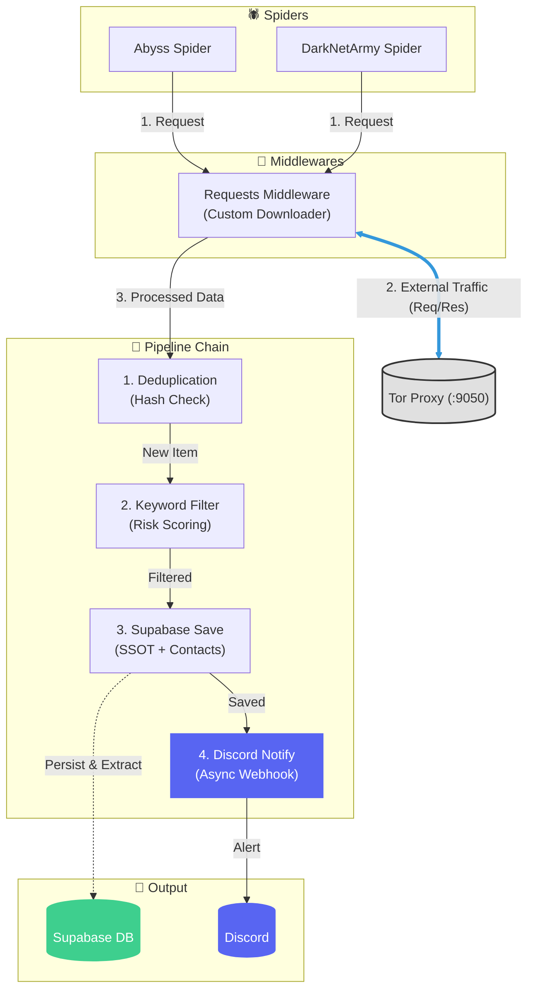

# TriCrawl MVP
TriCrawl은 다크웹 및 딥웹의 기업 정보 유출을 모니터링하는 OSINT 크롤러입니다.
`main` 브랜치는 개발 과정의 브랜치로, 팀원들을 위한 상세 주석이 포함되어 있습니다.
실제 배포 및 제출 브랜치는 `release` 브랜치로, 주석과 세부 문서 등이 제거되어 있습니다.

## MVP
- docker-compose
- Rich UI 콘솔
- 9개 랜섬웨어 사이트 크롤링
- Supabase DB
- Superset 대시보드
- 디스코드 알림

### 2026-01-31
[`lockbit5` 스파이더 추가]
- 3.0이 과거 데이터만 있어서, 5.0 페이지로 새롭게 추가함
- 쿠키 등 헤더 스푸핑으로 크롤링 가능,
- `config/lockbit5_cookies.json` 파일 관리는 필요함(최신 쿠키로 수정 필요)
[기타]
- Akira 스파이더를 비롯한 모든 스파이더 표준화 개선

### 2026-01-30
[팀원 개발 스파이더] - 하나의 브랜치로 통합
- `Pre-Request Dedup` 도입 통일, 이미 수집된 ID는 상세 페이지 요청 단계에서 즉시 스킵
- 데이터 필드 표준화 및 조회수(`views`) 수집 추가
- 하드코딩 제거 및 각종 오류 수정
[CLI 및 로직]
- `RichProgress` 추가, 실시간 크롤링 상태(수집/스킵/에러) 시각화 및 한글 에러 메시지 제공
- 크롤링 데이터에서 Telegram, Email, Discord 등 자동 추출하여 DB(`author_contacts`)에 jsonb 형식 저장
- 성능 개선

### 2026-01-27
- PostgreSQL(Supabase)로 DB 구성, 로컬 파일 아카이빙을 제거하고 Supabase DB(`darkweb_leaks`)를 SSOT로 격상
- 데이터베이스 작업 중 알림이 너무 많이 와서 켜기/끄기 추가함(.env에 저장됨)
- 기존 jsonl 저장 로직은 덤프 기능으로 변경, supabase db 데이터를 가져와서 jsonl로 저장
- 중복 로직 개선 : `DeduplicationPipeline`에서 로드한 중복 ID를 스파이더에게 주입하여, 불필요한 Tor 요청을 네트워크 단에서 사전 차단
- 그밖에 DarkNetArmy 스파이더 버그 수정 및 ID 생성 로직 URL해시 기반으로 통일해서 중복 처리 빨라짐


## 특징

- **Tor 통합**: 별도 설정 없이 `docker-compose` 한 번으로 Tor 프록시(Socks5h)와 연결됩니다.
- **모듈형 구조**: 새로운 크롤러(스파이더)나 필터 로직(파이프라인)을 쉽게 끼워 넣을 수 있습니다.
- **오탐지 최소화**: 타겟 키워드(국가/기업명)는 단독 매칭 시 CRITICAL로 분류되며, 조건부 키워드(leak 등의 포괄 의미 키워드)는 타겟과 함께 있을 때만 알림됩니다.
- **데이터 보존**: 모든 수집 데이터는 Supabase를 통해 아카이빙되며, CLI를 통해 파일로 내보낼 수 있습니다.
- **Discord 알림**: 위험도(Risk Level)에 따라 색상을 구분하여 즉각적인 알림을 보냅니다.
- **속도 최적화 (New)**: Pre-Request Dedup 기술로 중복 데이터 발생 시 불필요한 상세 페이지 요청을 원천 차단합니다.
- **위협 인텔리전스**: 게시글 본문에서 텔레그램, 이메일, 디스코드 등 연락처 정보를 자동 추출하여 저장합니다.

## 아키텍처(초기)



## 문서 가이드

필요한 문서는 `docs/` 폴더에 정리되어 있습니다.

| 주제 | 문서 링크 |
|------|-----------|
| **개발** | [개발자 가이드](./docs/developer_guide.md) |
| **분석** | [데이터 분석 가이드](./docs/analytics_guide.md) |
| **참조** | [파이프라인 명세](./docs/pipeline_reference.md) |
| **규격** | **[개발 표준](./docs/development_standard.md)** (⭐ 필독) |
| **상세** | [기능 명세서](./docs/atomic_specs.md) |

## 시작하기

### 1. 설치

```bash
git clone https://github.com/Tri-Best-3/tricrawl.git
cd tricrawl

python -m venv venv
.\venv\Scripts\activate  # Windows
pip install -r requirements.txt
```

### 2. 설정

`.env` 파일을 만들고 Discord Webhook URL을 넣으세요.

```bash
cp .env.example .env
```

### 3. 실행

관리자 콘솔(`main.py`)로 실행합니다.

```bash
python main.py
```

1. 메뉴에서 `1`번을 눌러 Docker(Tor)를 켭니다.
2. `3`번을 눌러 크롤러를 선택해 실행합니다.
3. 데이터 확인이 필요하면 `6`번을 눌러 DB 데이터를 내보내거나(JSONL/CSV), `5`번으로 알림을 켤 수 있습니다.

---

기능 추가 시 **[development_standard.md](./docs/development_standard.md)**를 꼭 확인해주세요.
특히 `items.py`의 데이터 컨트랙트(`risk_level` 등)를 지키지 않으면 알림이 오지 않거나 에러가 발생합니다.
